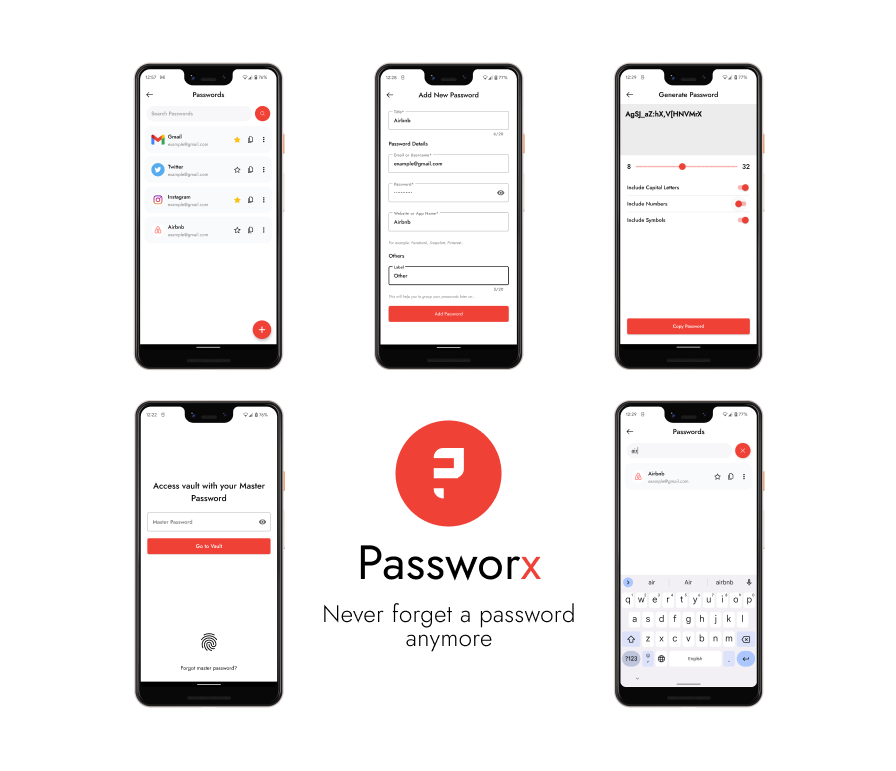

**Passworx** is a Password Manager application, which stores your passwords safely in your own phones locale storage. For now it has following functionalities and features:

- Adding Passwords 👽
- Editing password **Details**
- Generating and copying new password to use it anywhere you want 🕵️‍♂️
- Moving items to **Trash** ~~🗑️~~, accessing them in trash until deleted permanently
- All-time favorite **Dark Mode** 🌑
- Search functionality, to find passwords **Rapidly** 🚀
- Master password, to make passwords accessible only by the **User**
- Adding passwords to **Favorites** ⭐️
- **Fingerprint authentication**, to make users vault more secure 🔒
- **Autofill Service**, which helps users fill data in various apps

**Passworx** has a lot of upcoming features and functionalities, which involves:

- Checking passwords **Health** 🧑‍⚕️

**More info coming soon** 🚀 🤘
